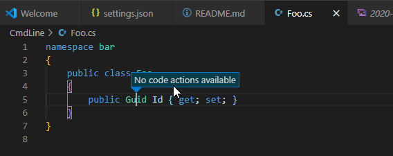
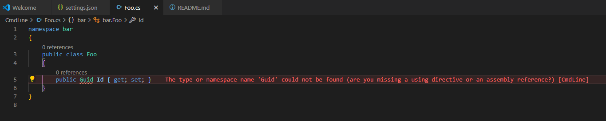
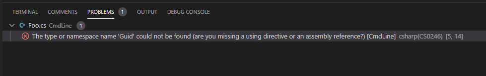
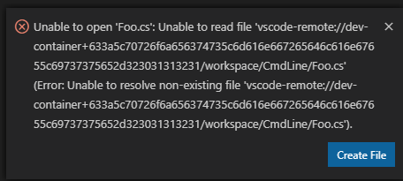

# issue-201121
Repository with sample code to reproduce an issue that appears to be caused by omnisharp-vscode

See https://github.com/OmniSharp/omnisharp-vscode/issues/4223 for discussion around this particular issue.


## Important Update
As of writing - 21 Nov 2020 - the issue is caused when Docker Desktop for Windows uses WSL2. In this scenario, when a Windows directory is mounted into the Linux file system, the issue described in here can be observed. This is caused by the current lack of inotify(7) events being sent by WSL2. Several related issues are reported: https://github.com/Microsoft/WSL/issues?q=is%3Aissue+is%3Aopen+inotify

This repo should work fine for WSL1, i.e. old-style WSL using a VM on Hyper-V.

Note, that this also works fine if you copy the files into the file system of a suitable Linux distro running on WSL2, then launching VS Code from there. Key point is to enable the integration of Docker Desktop for Windows with the distro you want to use. This is a setting in Docker Desktop for Windows under "Resources" - "WSL Integration".

# Prerequisites

- Docker Desktop 2.5.0.1 for Windows using WSL2
- VS Code 1.51.1
- Extension: "Remote Development" version 0.20.0 (Id: ms-vscode-remote.vscode-remote-extensionpack)

# Notes
The following may or may not be relevant to this issue:

- This example uses a dev container. Only VS Code runs on the host. vscode-server is running inside the dev container. 
- The directory on the host is mounted into the container at mount point /workspace.
- A non-root user named "repro" is created in the Dockerfile. VS Code connects to the dev container with that non-root user. All remote tools, e.g. vscode-server, terminals, etc. will be executed as that user.
- Because the base image for the .NET 5.0 SDK does not have `ps` installed, the Dockerfile compensates for that by installing `ps`

# Steps to Reproduce

1. Clone repo https://github.com/ManfredLange/issue-201121
2. Open root directory. This will prompt to reopen the directory in the container. Open directory in container
3. Once loading the container has completed, open VS Code preferences and switch to "Remote [Dev Container: repro]".
4. Edit json for remote settings and add `"omnisharp.path": "latest"`. This will show prompt to restart OmniSharp.
5. Wait for restart of OmniSharp to finish. Restart will pull latest OmniSharp for Linux. As of writing this was version 1.37.1-beta.61
6. Open terminal and run `dotnet build` to ensure everything compiles "as-is"
7. In directory `/workspace/CmdLine` create a new file named "Foo.cs". Add the following content:
   ```
   namespace bar
   {
      public class Foo
	  {
	     public Guid Id { get; set; }
	  }
   }
   ```
   This should cause OmniSharp to complain about "Guid" since `using System;` is missing. Furthermore, `Ctrl+.` should suggest adding the using statement. Instead it displays `No code actions available`:
   
8. Restarting OmniSharp picks up on the change and displays the problem as expected:
   
9. Deleting file `Foo.cs` will report an issue even though the file no longer exists:
   
   Clicking on the error message results in the following error notification:
   

   This error notification is correct as the file indeed no longer exists. It has just been deleted. Again, this problem can be resolved by restarting OmniSharp
   

Note that each time you rebuild the container, you will need to repeat steps 3 and 4 because the remote `settings.json` file will be lost.

It appears as if OmniSharp does not pick up on added, moved or deleted files.
